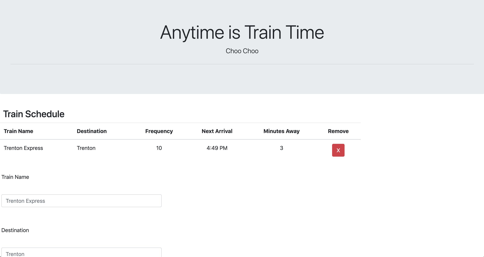

# train-activity

This program allows the user to enter information regarding train name,arrival time, and frequency. A table displays data entered by the user and is saved in Firebase and session storage. In addition, Firebase supplies information to the site on load.

